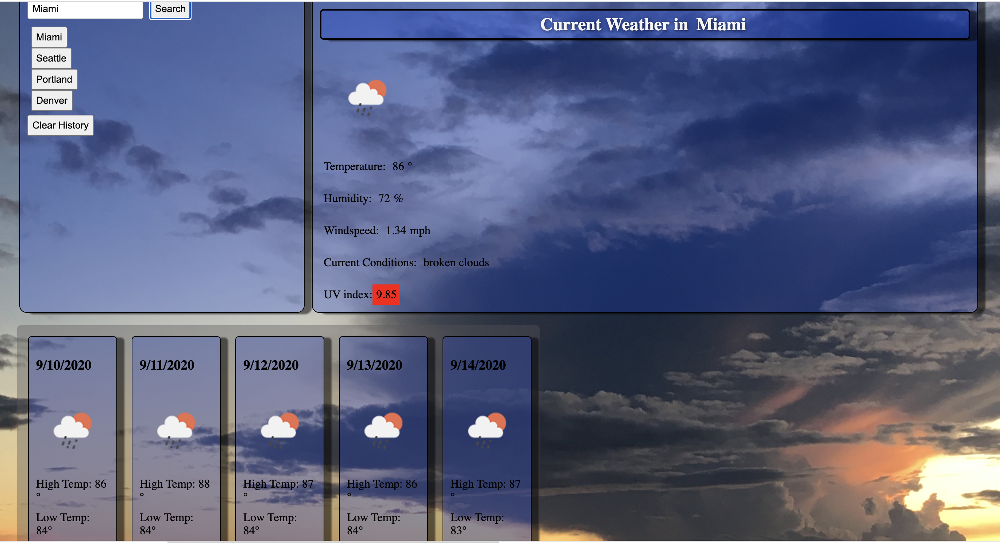

# Weather Dashboard

This is a tool to check the weather in any city. It utilizes a third party api to get the current weather conditions as well as the current UV index. It will also display the 5 day forecast for the city and add a button for each searched city that will be saved until the history is cleared.  
## Table of Contents
- [Usage](#usage)
- [Image](#image)
- [Questions](#questions)
## Installation

Installation
## Usage

This project uses the open weather API, J-query, Javascript, HTML, CSS. 
## Image

## Repository
- https://github.com/PeteLow-13/WeatherApp
## Questions

Contact me via email or github with questions
- pedritolow@gmail.com
- [PeteLow-13](http://github.com/PeteLow-13)